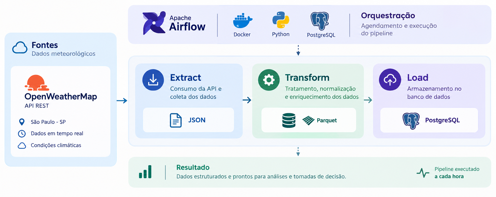

# 🌤️ Pipeline ETL - Dados Climáticos

Pipeline de Engenharia de Dados desenvolvido como projeto de estudo para coleta,
transformação e armazenamento de dados meteorológicos.

O projeto segue inicialmente os ensinamentos da **VBLUUIZA**, utilizando seu
tutorial como base para a implementação inicial. A partir dessa primeira versão,
o projeto será evoluído com novas práticas e tecnologias de Engenharia de Dados.

## 🏗️ Arquitetura

Fluxo principal do pipeline:



**Fluxo:** OpenWeatherMap → Extract → Transform → Load → PostgreSQL

A execução e orquestração do pipeline são realizadas pelo **Apache Airflow**,
com o ambiente executado em **Docker**.

## 🛠️ Tecnologias

- Python
- Apache Airflow
- PostgreSQL
- Docker
- Pandas
- Parquet
- OpenWeatherMap API

## 🎯 Objetivo

Praticar conceitos fundamentais de Engenharia de Dados através da construção de um pipeline ETL automatizado, utilizando uma API REST como fonte de dados.


```

A execução e o agendamento do pipeline são gerenciados pelo **Apache Airflow**.

---

## 🛠️ Tecnologias

* **Python**
* **Apache Airflow**
* **Pandas**
* **PostgreSQL**
* **Parquet**
* **Docker / Docker Compose**
* **Redis**
* **SQLAlchemy**
* **Requests**
* **UV**

---
## 📂 Estrutura

```text
.
├── dags/
│   └── weather_dag.py
├── src/
│   ├── extract_data.py
│   ├── transform_data.py
│   └── load_data.py
├── data/
├── notebooks/
├── config/
├── docker-compose.yaml
├── pyproject.toml
├── main.py
└── README.md
```

---

## 🔄 Pipeline

### Extract

Consome a API do **OpenWeatherMap** e armazena os dados meteorológicos em JSON.

### Transform

Utiliza **Pandas** para:

* Normalizar os dados;
* Tratar estruturas aninhadas;
* Padronizar colunas;
* Converter timestamps;
* Preparar os dados para armazenamento.

O resultado intermediário é salvo em **Parquet**.

### Load

Os dados transformados são carregados na tabela `sp_weather` do **PostgreSQL**.

---

## ⚙️ Airflow

A DAG `weather_pipeline` executa:

```text
extract()
    ↓
transform()
    ↓
load()
```

O pipeline está configurado para execução **a cada hora**.

---

## 🚀 Como Executar

### 1. Configure a API Key

Crie `config/.env`:

```env
API_KEY=sua_chave_api_aqui

user=airflow
password=airflow
database=airflow
```

> ⚠️ Não versione o arquivo `.env`.

### 2. Inicie os containers

```bash
docker-compose up -d
```

Verifique:

```bash
docker-compose ps
```

### 3. Acesse o Airflow

```text
http://localhost:8080
```

Execute a DAG:

```text
weather_pipeline
```

---

## 🗺️ Roadmap

### ✅ Implementado

* [x] Consumo de API REST
* [x] Pipeline ETL
* [x] Transformações com Pandas
* [x] Parquet
* [x] PostgreSQL
* [x] Apache Airflow
* [x] Docker

### 🔜 Próximos Updates

* [ ] Validação e qualidade dos dados
* [ ] Testes automatizados
* [ ] Tratamento de erros e retries
* [ ] Incremental Loading
* [ ] Arquitetura **Medallion (Bronze / Silver / Gold)**
* [ ] Melhorias de modelagem e performance SQL
* [ ] Processamento com **PySpark**
* [ ] Deploy em **Cloud**
* [ ] Evolução para aplicações de **Data & AI**

---

## 📚 Referência

Projeto desenvolvido como estudo a partir do conteúdo da **VBLUUIZA**.

* 🎥 [Tutorial no YouTube](https://www.youtube.com/watch?v=I8qPqbXQBDU)
* 💻 [Repositório original](https://github.com/vbluuiza/pipeline_etl_weather_data_tutorial_youtube)

---

## 👨‍💻 Autor

**Pedro Henrique de Souza Prado**

Engenheiro de Controle e Automação em transição para **Engenharia de Dados**.

* [LinkedIn](www.linkedin.com/in/pedro-hsprado-dataengineer)
* [GitHub](https://github.com/Dev-PPrado)

---

⭐ Projeto desenvolvido para fins de **estudo e portfólio**.
