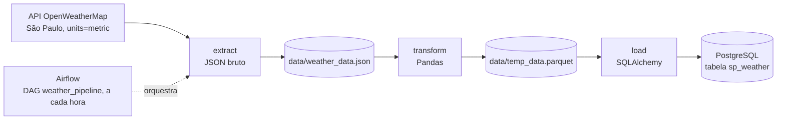

# Pipeline ETL de dados climáticos

**Página no portfólio:** https://dev-pprado.github.io/projetos/pipeline-weather/

Pipeline que coleta o clima atual de São Paulo na API do [OpenWeatherMap](https://openweathermap.org/api) a cada hora, transforma com Pandas e carrega no PostgreSQL. A orquestração é feita pelo Apache Airflow, com todo o ambiente em Docker.

O projeto começou a partir do [tutorial da VBLUUIZA](https://www.youtube.com/watch?v=I8qPqbXQBDU) ([repositório original](https://github.com/vbluuiza/pipeline_etl_weather_data_tutorial_youtube)) e está sendo evoluído a partir dele.

## O pipeline


```mermaid
flowchart LR
  API[API OpenWeatherMap<br/>São Paulo, units=metric] --> E[extract<br/>JSON bruto]
  E --> J[(data/weather_data.json)]
  J --> T[transform<br/>Pandas]
  T --> P[(data/temp_data.parquet)]
  P --> L[load<br/>SQLAlchemy]
  L --> DB[(PostgreSQL<br/>tabela sp_weather)]
  AF[Airflow<br/>DAG weather_pipeline, a cada hora] -.orquestra.-> E
```

A DAG fica em [`dags/weather_dag.py`](dags/weather_dag.py) e as etapas em [`src/`](src).

| Etapa | Código | O que faz |
|---|---|---|
| **Extract** | [`src/extract_data.py`](src/extract_data.py) | Chama a API do OpenWeatherMap e salva a resposta em `data/weather_data.json`. |
| **Transform** | [`src/transform_data.py`](src/transform_data.py) | Achata o JSON com `json_normalize`, abre a lista `weather` em colunas próprias, remove colunas sem uso, renomeia (`main.temp` → `temperature`, `dt` → `datetime`...) e converte `datetime`, `sunrise` e `sunset` de Unix para o fuso `America/Sao_Paulo`. O resultado vai para `data/temp_data.parquet`. |
| **Load** | [`src/load_data.py`](src/load_data.py) | Lê o Parquet e faz `to_sql` em modo `append` na tabela `sp_weather`. Depois conta as linhas da tabela e registra no log. |

### A DAG

| Configuração | Valor |
|---|---|
| `dag_id` | `weather_pipeline` |
| Agenda | `0 * * * *` (a cada hora) |
| Tarefas | `extract >> transform >> load` |
| Retries | 1, com 5 minutos de espera |
| `catchup` | `False` (não roda execuções passadas) |

### Tabela `sp_weather` (algumas colunas)

A tabela é criada pelo próprio Pandas na primeira carga, então os tipos são os inferidos por ele.

| Coluna | Tipo | Regra |
|---|---|---|
| `datetime` | timestamptz | Fuso America/Sao_Paulo |
| `city_name` | text | |
| `temperature` | double precision | °C |
| `humidity` | bigint | % |
| `weather_description` | text | |

### Decisões de engenharia

- **Uma tarefa por etapa:** extract, transform e load são tarefas separadas no Airflow, então dá para ver e reexecutar cada uma pela interface.
- **Arquivos intermediários:** as tarefas trocam dados por arquivo (JSON bruto e Parquet) em `data/`, uma pasta compartilhada entre os containers. O Parquet mantém os tipos (inclusive o fuso das datas) entre o transform e o load.
- **Histórico em append:** cada execução adiciona uma linha nova em `sp_weather`, formando uma série temporal do clima.
- **Credenciais fora do código:** chave da API e acesso ao banco ficam em `config/.env`, que não é versionado.
- **Logs:** cada etapa usa `logging`, visível nos logs das tarefas no Airflow.

## Stack

| Parte | Tecnologias |
|---|---|
| Pipeline | Python, Requests, Pandas, Parquet, SQLAlchemy, psycopg2 |
| Orquestração | Apache Airflow 3 (CeleryExecutor, Redis) |
| Banco | PostgreSQL |
| Infraestrutura | Docker, Docker Compose, uv |

## Como rodar localmente

Pré-requisitos: Docker com Docker Compose e uma [chave de API do OpenWeatherMap](https://home.openweathermap.org/api_keys).

1. Crie `config/.env` com a chave da API e o acesso ao PostgreSQL onde os dados serão gravados:

   ```env
   API_KEY=sua_chave_aqui
   user=postgres
   password=sua_senha
   data_base=nome_do_banco
   ```

2. Crie um `.env` na raiz (o `docker-compose.yaml` exige esse arquivo):

   ```env
   AIRFLOW_UID=50000
   ```

3. Suba o ambiente:

   ```sh
   docker compose up -d
   docker compose ps     # espere os serviços ficarem healthy
   ```

4. Acesse o Airflow em http://localhost:8080 (usuário e senha `airflow`), ative a DAG `weather_pipeline` (ela começa pausada) e dispare uma execução.

O load conecta em `host.docker.internal:5432`, ou seja, num PostgreSQL rodando na sua máquina. O PostgreSQL do `docker-compose.yaml` é o banco de metadados do Airflow e não expõe porta para fora.

Para explorar o JSON extraído, há um notebook em [`notebooks/analysis_data.ipynb`](notebooks/analysis_data.ipynb).

## Estrutura

```text
.
├── dags/
│   └── weather_dag.py        # DAG weather_pipeline
├── src/
│   ├── extract_data.py
│   ├── transform_data.py
│   └── load_data.py
├── notebooks/
│   └── analysis_data.ipynb   # exploração do JSON da API
├── images/                   # pipeline_architecture.png
├── docker-compose.yaml       # Airflow, PostgreSQL de metadados e Redis
├── main.py                   # versão antiga do pipeline sem Airflow (comentada)
└── pyproject.toml
```

As pastas `config/`, `data/`, `logs/` e `plugins/` são montadas nos containers e ficam fora do Git.

## Limitações conhecidas

- **Cidade fixa:** a URL da API está na DAG com São Paulo.
- **Sem validação:** o extract não trata falhas de rede, e uma resposta fora do esperado só quebra no transform.
- **Leitura da tabela inteira no load:** a contagem de linhas faz `SELECT *` em `sp_weather`, o que fica mais lento conforme a tabela cresce.
- **Sem testes automatizados.**

## Próximos passos

- [ ] Validação e qualidade dos dados
- [ ] Testes automatizados
- [ ] Tratamento de erros e retries no extract
- [ ] Carga incremental
- [ ] Arquitetura medallion (bronze, silver, gold)
- [ ] Processamento com PySpark
- [ ] Deploy em cloud
